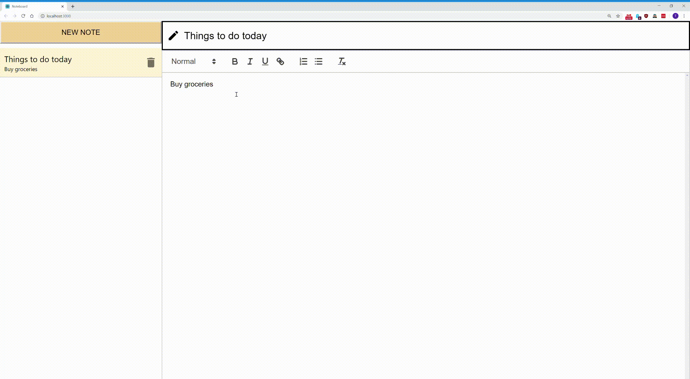

# Noteboard

Noteboard is a note-taking web application built around the React front-end framework, Firebase's Firestore database, and react-quill editor.



## Before running the application

* Make sure that `npm` is installed
* Open terminal, navigate to the project directory and run `npm install` to install dependencies
* Create `config.js` file with following code inside `src` folder and replace template with your Firebase project configuation
```
var config = {
  firebase: {
    apiKey: "__API_KEY__",
    authDomain: "__AUTH_DOMAIN__",
    databaseURL: "__DATABASE_URL__",
    projectId: "__PROJECT_ID__",
    storageBucket: "__STORAGE_BUCKET__",
    messagingSenderId: "__MESSAGING_SENDER_ID__",
    appId: "__FIREBASE_APP_ID__"
  }
}

export default config;
```

This project was bootstrapped with [Create React App](https://github.com/facebook/create-react-app).

## Available Scripts

In the project directory, you can run:

### `npm start`

Runs the app in the development mode.<br />
Open [http://localhost:3000](http://localhost:3000) to view it in the browser.

The page will reload if you make edits.<br />
You will also see any lint errors in the console.

### `npm run build`

Builds the app for production to the `build` folder.<br />
It correctly bundles React in production mode and optimizes the build for the best performance.

The build is minified and the filenames include the hashes.<br />
Your app is ready to be deployed!

See the section about [deployment](https://facebook.github.io/create-react-app/docs/deployment) for more information.